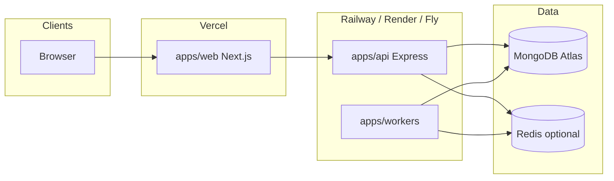

# Deployment guide

This document describes a production-oriented layout for JobFlow: **Next.js on Vercel**, **Express API and workers on Railway** (or Render/Fly with the same containers/commands), **MongoDB Atlas**, and optional **Redis** for BullMQ.

## Architecture



## Deployment order

1. **MongoDB Atlas** — create a cluster, allow inbound from your hosting egress IPs (or `0.0.0.0/0` initially with strong auth), obtain `MONGODB_URI`.
2. **Redis** (optional) — if using `QUEUE_MODE=bullmq`, provision Redis and set `REDIS_URL`.
3. **API** — deploy `Dockerfile.api` or run `pnpm install && pnpm --filter @jobflow/api build` with `NODE_ENV=production` and required env vars.
4. **Workers** — deploy `Dockerfile.workers` or the same pnpm build for `@jobflow/workers`; use the same `MONGODB_URI` / queue settings as the API where applicable.
5. **Web (Vercel)** — set root directory to `apps/web` (or monorepo root with the provided `vercel.json`), configure `NEXT_PUBLIC_API_URL` to the public API URL.

## Build and start commands

| Service  | Build | Start |
|----------|--------|--------|
| Web | `pnpm --filter @jobflow/web build` | `pnpm --filter @jobflow/web start` (Next `next start`) |
| API | `pnpm --filter @jobflow/api build` | `pnpm --filter @jobflow/api start` → `node dist/apps/api/src/server.js` (cwd `apps/api`) |
| Workers | `pnpm --filter @jobflow/workers build` | `pnpm --filter @jobflow/workers start` → `node dist/apps/workers/src/index.js` (cwd `apps/workers`) |

Docker (from repo root):

- API: `docker build -f Dockerfile.api -t jobflow-api .`
- Workers: `docker build -f Dockerfile.workers -t jobflow-workers .`

## Required environment variables

### API (`NODE_ENV=production`)

| Variable | Purpose |
|----------|---------|
| `NODE_ENV` | Must be `production`. |
| `PORT` | Listen port (Railway/Render inject this). |
| `MONGODB_URI` | MongoDB connection string. |
| `JWT_SECRET` | Signing key for API JWTs. |
| `APP_URL` | Public **web** origin (used for CORS in production). |
| `ENCRYPTION_KEY` | Application encryption (OAuth/token material). |
| `API_PUBLIC_URL` | Public base URL of this API (OAuth links, callbacks). |
| `LOG_LEVEL` | Optional; default `info` (see Pino levels). |

Optional (warned if missing): `REDIS_URL`, Google OAuth, AI keys, Stripe, SMTP — see `.env.example`.

### Workers (`NODE_ENV=production`)

| Variable | Purpose |
|----------|---------|
| `MONGODB_URI` | Same database as the API. |
| `JWT_SECRET` | Must match API if workers verify tokens. |
| `ENCRYPTION_KEY` | Same as API for shared crypto. |
| `QUEUE_MODE` | `memory`, `bullmq`, or `disabled`. If `bullmq`, set `REDIS_URL`. |
| `REDIS_URL` | Required when `QUEUE_MODE=bullmq`. |

### Web (Vercel / production build)

| Variable | Purpose |
|----------|---------|
| `NEXT_PUBLIC_API_URL` | HTTPS URL of the API (e.g. `https://api.example.com`). |

`NEXT_PUBLIC_DEMO_TENANT_ID` is optional unless you rely on demo/mock flows.

## Health checks

| Endpoint | Use |
|----------|-----|
| `GET /health` | Summary: uptime, DB state, queue mode. |
| `GET /health/ready` | **Readiness** — `200` if MongoDB is connected, else `503`. Use for Railway/Render/Fly/Kubernetes. |
| `GET /health/live` | **Liveness** — `200` unless the process is shutting down (`503`). |

Configure your platform’s health check path to `/health/ready` for the API service.

Workers expose `getWorkerHealth()` / `runWorkerHealthCheck()` in process; add a small HTTP sidecar later if you need HTTP probes.

## Demo seed

After the database is reachable:

```bash
pnpm seed:demo
```

Run from CI or a one-off job with `MONGODB_URI` set.

## Rollback checklist

- Revert the deployment to the previous image/release in Railway/Vercel.
- Confirm `MONGODB_URI` and secrets unchanged.
- Run `/health/ready` until `200`.
- Verify web `NEXT_PUBLIC_API_URL` still points at the correct API stage.
- If billing or webhooks are enabled, confirm Stripe webhook URL and signing secret match the rolled-back API URL.

## Railway notes

- Root `railway.json` references `Dockerfile.api` for a single API service. Create a **second** Railway service for workers: same repo, **Dockerfile** `Dockerfile.workers`, same env minus web-only vars.
- Do not commit secrets; use Railway variables.

## Vercel notes

- `apps/web/vercel.json` installs from the monorepo root and builds `@jobflow/web`.
- Set the project **Root Directory** to `apps/web` in the Vercel dashboard if you are not deploying from the monorepo root with custom settings.

## Local prerequisite for automation queue

The API imports `@jobflow/workers/queue` at runtime. After a fresh clone, build workers once so the compiled queue module exists:

```bash
pnpm --filter @jobflow/workers build
```

Or run a full `pnpm build` at the monorepo root.
